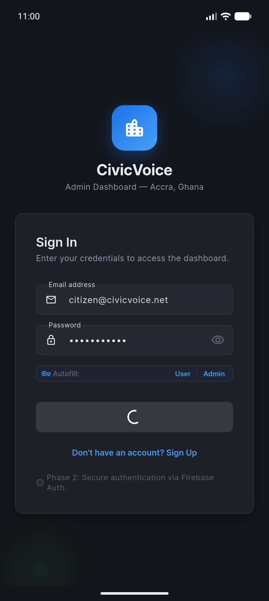
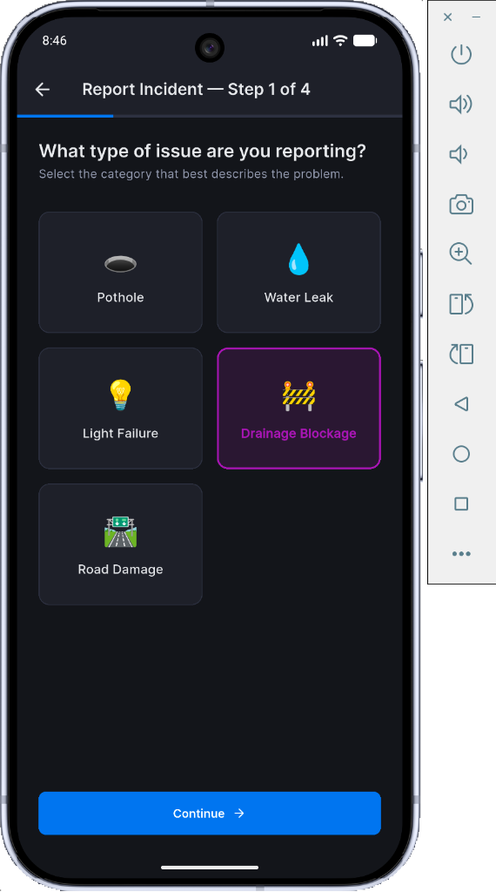
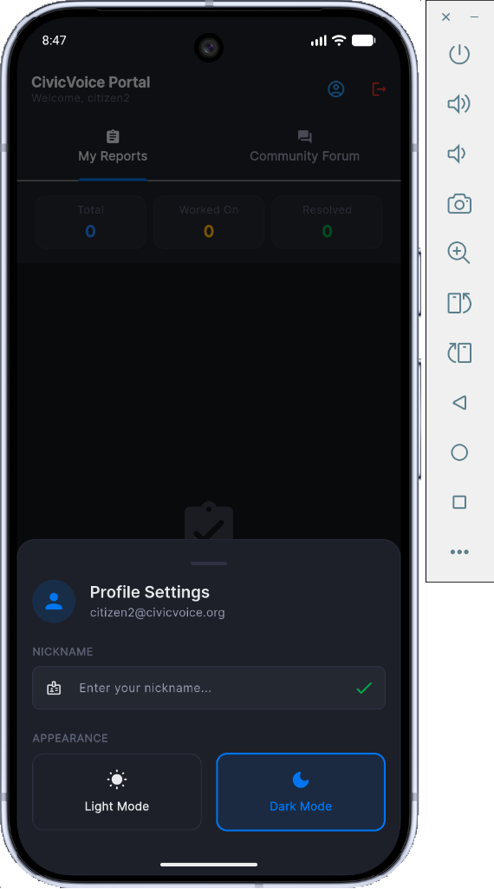
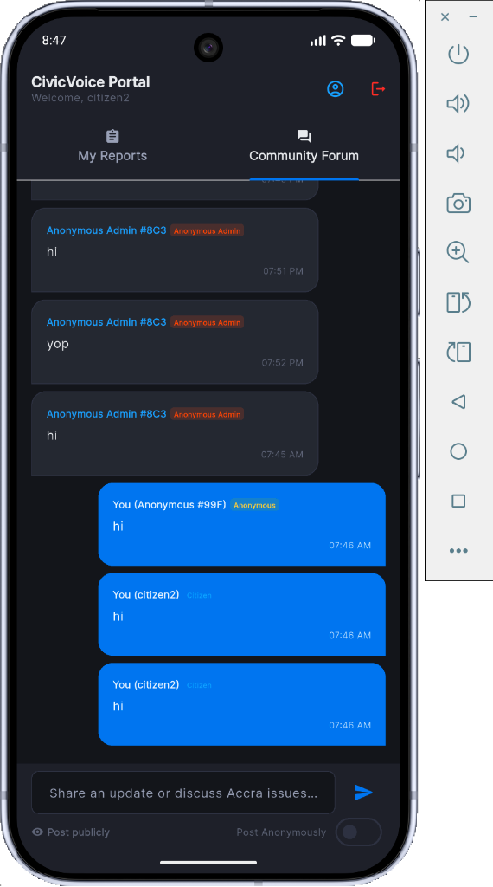
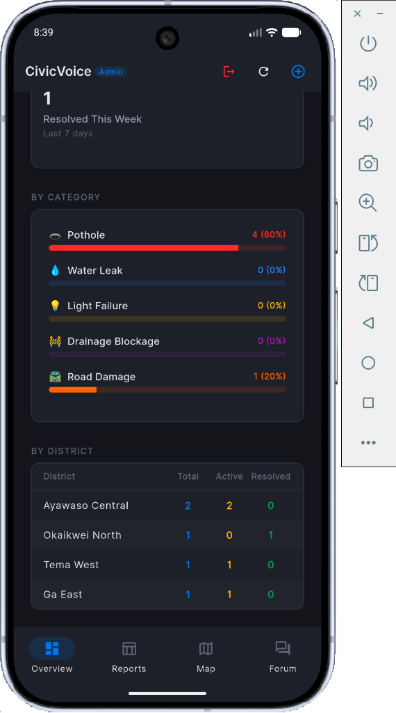
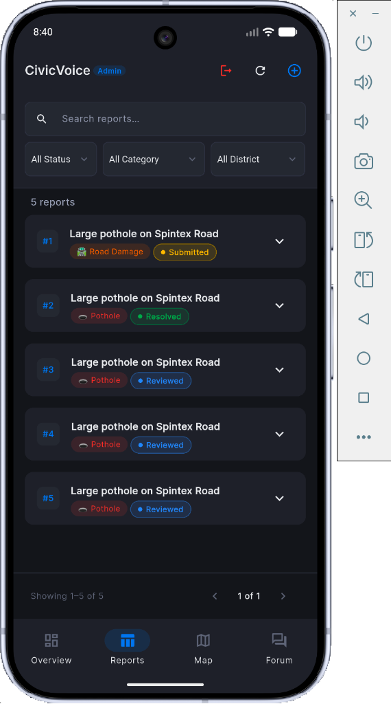
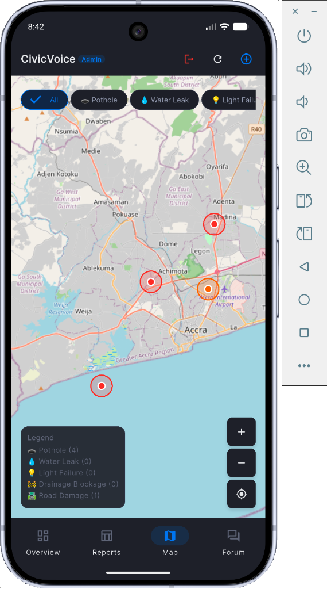

# CivicVoice

CivicVoice is a modern, responsive civic incident reporting platform built for Accra, Ghana. It empowers citizens to submit, track, and discuss public utility, infrastructure, and environmental issues, while providing municipal administrators with a powerful dashboard to prioritize, map, and resolve reports.

---

## Application Preview

### Citizen App Views

|                  Citizen Dashboard                   |                   Report Submission Flow                   |                     Profile & Settings                     |                    Community Forum                     |
| :--------------------------------------------------: | :--------------------------------------------------------: | :--------------------------------------------------------: | :----------------------------------------------------: |
|  |  |  |  |

### Admin Panel Views

|                     Admin Overview & Stats                     |                   Live Reports Management                    |                 Admin Map View (OSM)                 |
| :------------------------------------------------------------: | :----------------------------------------------------------: | :--------------------------------------------------: |
|  |  |  |

---

## Key Features

- **Citizen Incident Reporting:**
  - **Categorized Submissions:** Submit issues under categories like Road Hazards, Waste Management, Water Supply, Power Outage, and Public Safety.
  - **Actual GPS Geolocation:** Fetches precise device coordinates with coarse/fine location permission checks.
  - **Offline District Geocoding:** Automatically maps coordinates to municipal districts using a nearest-neighbor offline Accra coordinate boundary dataset.
  - **Camera & Gallery Attachments:** Capture and attach images directly to incident reports.

- **Admin Dashboard:**
  - **Metric Statistics:** Visual card components showing total, pending, and resolved incidents, alongside resolution rates.
  - **Dynamic District Table:** A live overview breaking down reports and unresolved counts for each district.
  - **Live Incident Management:** Tabular search, filter, and action list to examine details and update report statuses (Submitted, Under Review, In Progress, Resolved).

- **OpenStreetMap Map View:**
  - Uses the free, API-key-less `flutter_map` engine.
  - Displays interactive markers for active incident reports with filter options.

- **Community Forum:**
  - Post updates and reply to announcements.
  - **Anonymous Posting:** Users and admins can toggle settings to post anonymously (admins appear under generated `Anonymous Admin #hex` badges).
  - **Pinned Announcements:** Admins can pin broadcasts/announcements to the top of the forum feed.

- **Global Settings:**
  - Dual theme modes (Sun/Moon toggles) powered by a global `ThemeProvider`.
  - Customized profile editor for user nicknames.

- **Security & Autofill Gating:**
  - Credentials autofill is gated under `kDebugMode`. It appears only in development builds and is completely tree-shaken and hidden in release builds (like the APK).

---

## Setup & Installation

### Prerequisites

- Flutter SDK (Targeting `>=3.10.4 <4.0.0`)
- Android SDK (for mobile packaging)

### Run the App

1. Clone this repository to your local machine.
2. Run package resolution:
   ```bash
   flutter pub get
   ```
3. Run the application locally (Autofill will be visible for easy logins):
   ```bash
   flutter run
   ```

### Compile the Release APK

To compile the production-ready Android package (autofill will be securely hidden):

```bash
flutter build apk --release
```

_Note: A compiled copy is saved in [assets/app-release.apk](assets/app-release.apk) for quick sharing._

### Compile the Web Target

```bash
flutter build web
```

---

## Testing

To run the full suite of unit and widget tests:

```bash
flutter test
```

_(All 30 tests cover State Management, geocoding logic, UI routing, and status calculations)._
